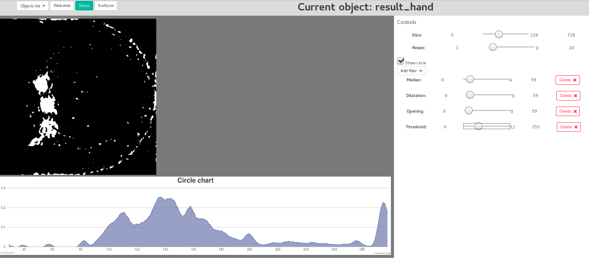

# Backend
За основу REST-сервиса была взята библиотека [Spark](http://sparkjava.com/).
Процессинг изображений реализован с помощью opencv 3.4 ([opencv javadoc](https://docs.opencv.org/3.4/javadoc/index.html))
Работа с файлами формата hdf5 использовалась библиотека jhdf5 ([javadoc](http://svnsis.ethz.ch/doc/openbis/S177.0/index.html?overview-summary.html))
## Описание основных пакетов и классов
* com.rbtm.reconstruction:Constants - все константы, включая различные пути
* com.rbtm.reconstruction.Utils - различные полезные классы
* com.rbtm.reconstruction.Utils:Timer удобно использовать, если нужно засечь время на определенном участке
* com.rbtm.reconstruction:Main - описание всех рест запросов
* com.rbtm.reconstruction:WebAppHealper - вспомгательный класс для обработки рест запросов
* com.rbtm.reconstruction.Converters - собраны конвертеры датасетов между форматами. Реализованы
    * hdf5 файл -> набор png изображений
    * hdf5 файл -> набор Mat
    * набор png изображений -> obj файл
* com.rbtm.reconstruction.DataProcessing - классы по обработке изображений
* com.rbtm.reconstruction.DataProcessing.Circle - классы для построения диаграммы по интегрированию колец
* com.rbtm.reconstruction.MarchingCubes - Классы по алгоритму марширующих кубов
## REST API:
* **GET /objects/all/**
    * **Описание:** Возращает список всех объектов доступных для исследования
    * **Тело запроса:** -
    * **Возр. тип:** json
    * **Комментарий:** парсит список фалов, в дирестории OBJ_PATH, указаной в константах'

* **GET /objects/all/current/**
    * **Описание:** Возвращает имя объекта, который выбран на данный момент
    * **Тело запроса:** -
    * **Возр. Тип:** text
    * **Тело ответа:** Имя объекта, выбраного последним. По дефолту возращает ""

* **POST /objects/all/current/**
    * **Описание:** Выбрать новый объект для исследования
    * **Тело запроса:** {"objName": String }
    * **Возр. Тип:** text
    * **Тело ответа:** если операция выполнена успешно вернется имя объекта, если такого объекта нет, вернется “Fail”
    * **Комментарий:** после того, как выбран объект идет проверка, есть ли конвертированная модель в png формат, Если такой нет, то запускается конвертация hdf5->png array. Это позволило очень сильно сократить выполнение некоторых операций.

* **POST /objects/all/current/forceInit/**
    * **Описание:**  запускает конвертацию hdf5->png array.
    * **Тело запроса:** -
    * **Возр. Тип:** text
    * **Тело ответа:** строка Success при успехе и Fail, если произошел сбой.
    * **Комментарий:** операция нужна, если мы не уверены в консистентности данных (например повреждение буфера или  искажение данных в нем) и требуется переконвертация

* **GET /objects/all/current/shape/**
    * **Описание:** возвращает размеры объекта, который выбран на данный момент
    * **Тело запроса:** -
    * **Возр. Тип:** json
    * **Тело ответа:** {num: int, heigth: int, width: int}
    * **Комментарий:**

* **POST /objects/all/current/slice/filters/**
    * **Описание:** задает фильтры в формате json массива
    * **Тело запроса:** [{имя_филтра: значение_филтра}, ...]
    * **Возр. Тип:** text
    * **Тело ответа:** Возвращает Success при успехе и Fail, если произошел сбой
    * **Комментарий:** порядок в пересылаемом массиве важен

* **GET /objects/all/current/slice/:id/**
    * **Описание:** возвращает срез с номером id и заданными фильтрами в формате png
    * **Тело запроса:**
    * **Возр. Тип:** binary
    * **Тело ответа:** бинарный файл с картинкой в формате png

* **GET /objects/all/current/slice/:id/circleDiagram/**
    * **Описание:** Возвращает данные для построения диаграммы интегрирования окружностей для среза с номером id и заданными фильтрами
    * **Тело запроса:** -
    * **Возр. Тип:** json
    * **Тело ответа:** {radius: int, value: float}, ...]
    * **Комментарий:** если нет подсчитанной диаграммы для текущих значений, делается подсчет и записывается в буфер, иначе возвращается диаграмма из буфера.

* **GET /objects/all/current/objFile/**
    * **Описание:** Возвращает 3d объект в формате .obj
    * **Тело запроса:** -
    * **Возр. Тип:** text
    * **Тело ответа:** Текст с описанием модели в формате obj
    * **Комментарий:** Это оказалась достаточно тяжелая операция, тк размер файла может достигать 100-150мб. Браузер кидает ООМ

# Frontend
Для css-шаблонов используется библиотека [bulma.io](https://bulma.io)
У нее достаточно понятная и простая документация и есть все необходимое для данной задачи.
Интерфейс выглядит следующим образом:

Его можно разделить на следующие елементы:
* **Строка выбора** - здесь можно можно выбрать объект для исследования, тип визуализации.
Так же здесь отображается имя объекта, который иследуется в данный момент.
Сейчас доступны следующие вкладки:
    * Welcome - где отображается данный текст
    * Slice - послойная визуализация
    * Surfaces - визуализция с помощью изоповерхностей
* **Окно визуализации** - область визулаизации, которая делится на 2 части:
    * Область визуализации - область где непосредственно происходит визуализация
    * Панель нстроек - настройки и елементы управления, для каждого типа визуализации свои настройки

## Описание скриптов
Все скрипты вынесены в одно место, в конец index.html Порядок фалов важен

### 3party библиотеки
* **3party-scripts/Three.js** - библиотека three.js
* **3party-scripts/OBJLoader.js** - загрузка obj файлов
* **3party-scripts/OrbitControl.js** - управление камерой в three.js сцене
* **canvasjs** - для построения графиков. Был вариант с d3.js но показалось силишком громозким решением для построения одного графика
### вспомогательные скрипты
* **scripts/globalVars.js** - глобальные переменные
* **scripts/networkHelper.js** - функция для ajax запросов

### основные скрипты
* **scripts/threeJsManipulations.js** - все что связано с three.js:
    * создание и рендеринг сцены
    * добавление управления камерой
    * загрузка obj файла
    * логика кнопок управления
    * удаление сцены (TODO: после удаления все равно блокируется все остальное, нужно перезагружать страницу)
* **scripts/chartViz.js** - создание графика (x - радиус, y - относительная сумма по кольцу)
* **scripts/imgSliceUpdater.js** - Скрипт для для обновления среза.
    * Отпрвлет серверу список фильтров
    * Обновляет изображение среза
    * Высчитывает новые параметры изображения
    * Вызывает метод построения графиков из chartViz. Использует библиотеку canvasjs
* **scripts/objectListUploader.js** - выгружает с сервера список доступных объектов для исследования.
    Запускается один раз на загрузке страницы. Полученый список генерирует в выпадающее меню в строке выбора
* **scripts/filterGenerator.js** - скрипт
* **scripts/index.js** - скрипт, запускающийся на старте страницы:
    * Делает активными все падающие меню.
    * Проставляет необходимые действия всем кнопкам
    * Запускает objectListUploader.
* **scripts/sliderUi.js** - скрипт необходимый чтобы все слайдеры были интерактивными